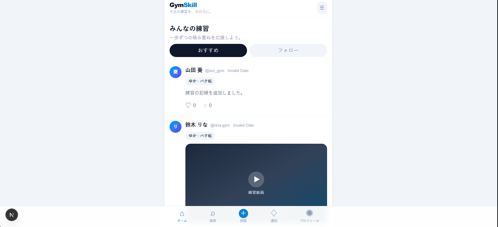
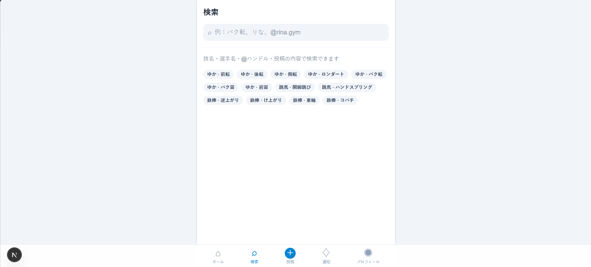
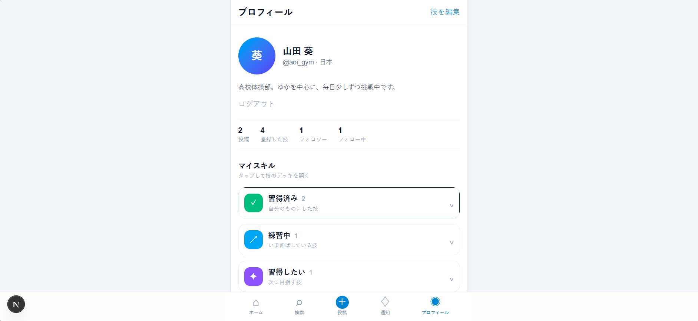

# GymSkill

器械体操選手が練習を記録・共有・応援できる、スマートフォン優先のSNS型Webアプリです。

現在はVersion 1のプロトタイプとして開発しており、データはブラウザのlocalStorageに保存しています。

## 開発の目的

器械体操では、自分が練習している技や、これから習得したい技を記録・共有できるサービスがあると便利だと考え、開発を始めました。

また、Webアプリを実際に開発することで、プログラミングやシステム開発について学ぶことも目的としています。

## 使用技術

- Next.js
- TypeScript
- Tailwind CSS
- localStorage
- pnpm

## 実装済み

- タイムライン
- いいね
- 投稿詳細
- コメント
- 技名・種目からの検索
- 関連する選手・投稿の表示
- 練習投稿の作成
- 通知UI
- プロフィール
- 技の状態登録
  - 習得済み
  - 練習中
  - 習得したい

## データ保存

投稿、コメント、いいね、登録技などのデータは、ブラウザの `localStorage` に保存されます。

現在はバックエンドを使用していないため、ブラウザのサイトデータを削除すると初期状態に戻ります。

## 開発環境

Node.js 20以上を使用してください。

## アプリ画面

### ホーム



### 検索



### プロフィール



```bash
pnpm install
pnpm dev
起動後、ブラウザで以下を開いてください。
http://localhost:3000
